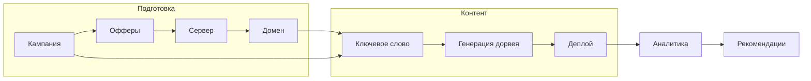
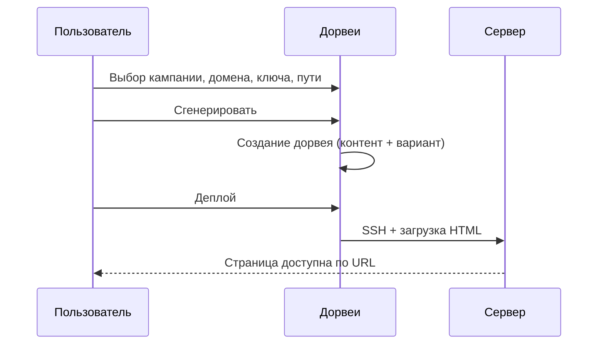
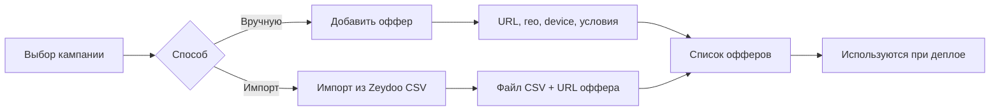

# Полная инструкция по Dorvey

Пошаговое руководство: что, где, в какой последовательности настраивать и использовать. С визуализацией разделов и полей.

---

## Оглавление

1. [Введение и общая схема](#1-введение-и-общая-схема)
2. [Вход и первый запуск](#2-вход-и-первый-запуск)
3. [Дашборд](#3-дашборд)
4. [Кампании](#4-кампании)
5. [Дорвеи](#5-дорвеи)
6. [Офферы](#6-офферы)
7. [Ключевые слова](#7-ключевые-слова)
8. [Шаблоны](#8-шаблоны)
9. [Серверы и домены](#9-серверы-и-домены)
10. [Аналитика и рекомендации](#10-аналитика-и-рекомендации)
11. [Push-реклама и SEO](#11-push-реклама-и-seo)
12. [Настройки (все блоки)](#12-настройки-все-блоки)
13. [Пользователи](#13-пользователи)
14. [Чек-листы и сценарии](#14-чек-листы-и-сценарии)

---

## 1. Введение и общая схема

Dorvey — система для создания и деплоя дорвеев (посадочных страниц) с привязкой к кампаниям, офферам и аналитике.

**Общая последовательность работы:**

**Схема потока (визуализация):**

**Где что находится в меню:**

| Меню в сайдбаре | Раздел | Назначение |
|-----------------|--------|------------|
| **Кампании** | Кампании | Новая кампания = новый проект (офферы, дорвеи, настройки конверсии) |
| | Дорвеи | Создание и деплой страниц по ключевым словам |
| | Офферы | Ссылки по гео/устройствам, импорт из Zeydoo, условия оффера |
| | Ключевые слова | База ключей для генерации дорвеев |
| **Контент** | Шаблоны | HTML-шаблоны страниц |
| **Инфраструктура** | Серверы | SSH-доступ для деплоя |
| | Домены | Домены, привязанные к серверам и кампаниям |
| **Аналитика** | Аналитика | Метрики, графики, конверсии |
| | Рекомендации по офферам | Какие страны/офферы брать (наши данные + внешние) |
| | Push-реклама | Рассылки и подписчики |
| | SEO | Внутренние ссылки, каннибализация |
| **Система** | Настройки | Все интеграции, ключи, вебхуки, внешние данные |
| | Пользователи | Управление пользователями (админ) |

---

## 2. Вход и первый запуск

**URL:** тот, на который развёрнут фронт (например `https://your-domain.com`).

**Первый вход (если БД пустая):**
- Email: `admin@dorvey.local` (или из `DEFAULT_ADMIN_EMAIL` в .env)
- Пароль: `ChangeMeNow123!` (или из `DEFAULT_ADMIN_PASSWORD`)

Сразу смените пароль в Настройках или через смену пароля в профиле.

**Визуализация:** после входа вы попадаете на **Дашборд**. Слева — сайдбар с разделами, сверху — хлебные крошки.

---

## 3. Дашборд

**Путь в меню:** главная (иконка «Дашборд» или «/»).

**Что видно:**
- Карточки: число кампаний, дорвеев, серверов, доменов (с переходами в разделы).
- Метрики за 30 дней: показы, клики, CTR, конверсии, CR, выручка, «Дорвеев с прибылью».
- Графики и блоки по кампаниям, аномалиям, рекомендациям партнёрских сетей (по ключевому слову).

**Последовательность:** дашборд используется для обзора; настройка идёт в соответствующих разделах.

---

## 4. Кампании

**Путь в меню:** Кампании → Кампании.

**Зачем:** одна кампания = один «проект»: свои дорвеи, офферы, домены, правила конверсии.

**Порядок действий:**
1. Нажать **«Добавить кампанию»** (или аналог).
2. Заполнить поля (см. ниже).
3. Сохранить. Дальше к этой кампании привязываются дорвеи, офферы, домены.

**Поля кампании:**

| Поле | Что вводить | Обязательность |
|------|-------------|-----------------|
| **Название** | Любое имя (например «Кредиты RU») | Да |
| **Affiliate URL** | Ссылка на оффер/лендинг, куда ведёт CTA на дорвее. Если офферов несколько — можно указать основной или оставить пустым и настроить офферы отдельно | Рекомендуется для первого теста |
| Остальные поля (правила, настройки) | По умолчанию; при необходимости — см. раздел Настройки и правила кампании в документации | Нет |

**Визуализация:** список кампаний и форма создания/редактирования.

---

## 5. Дорвеи

**Путь в меню:** Кампании → Дорвеи.

**Зачем:** создание посадочных страниц по ключевым словам и их выкладка на сервер (деплой).

**Общая последовательность:**

**Шаги по порядку:**

1. **Создание дорвея (генерация)**  
   - Нажать **«Сгенерировать»** (или «Добавить»).  
   - В форме: **Кампания** — выбрать созданную кампанию. **Домен** — домен, на котором будет страница. **Ключевое слово** — например `кредит наличными`. **Путь** — URL-путь, например `/` или `/kredit`.  
   - Опции: сохранить в БД, сгенерировать FAQ (если включён OpenAI).  
   - Подтвердить. Дорвей появится в списке со статусом «Черновик» или «Задеплоен» в зависимости от логики.

2. **Деплой**  
   - В списке дорвеев найти нужный и нажать **«Деплой»**.  
   - Система по SSH подключается к серверу домена и заливает сгенерированный HTML в указанный путь.  
   - После успешного деплоя статус меняется (например на «Задеплоен»).

3. **Фильтры и таблица**  
   - Фильтры: по кампании, домену, прибыльности, поиск по пути/заголовку.  
   - В таблице: ID, кампания, путь, «Здоровье» (метрики), статус, действия (деплой, рекомендации, варианты и т.д.).

**Визуализация:** экран списка дорвеев с фильтрами и кнопкой «Сгенерировать»; блок «Внешние данные по странам», если включены внешние данные в Настройках.

---

## 6. Офферы

**Путь в меню:** Кампании → Офферы.

**Зачем:** разные ссылки для разных стран (гео) и устройств (mobile/desktop); роутинг на дорвее подставляет нужный оффер. Сюда же — импорт из Zeydoo и условия оффера (описание, ограничения, рекомендации).

**Последовательность:**

**Действия по порядку:**

1. **Выбрать кампанию** в выпадающем списке вверху страницы Офферы.
2. **Добавить офферы** одним из способов:
   - **Вручную:** «Добавить оффер» → заполнить URL, название, ставку, гео, device, при необходимости — описание, ограничения, рекомендации (текстом или «Распознать со скрина»).
   - **Импорт из Zeydoo:** «Импорт из Zeydoo CSV» → указать **URL оффера** (трекинг-ссылка из Zeydoo) → выбрать файл CSV (Export to CSV со страницы оффера) → «Импортировать». По каждой строке (гео) создаётся оффер с этим URL.

**Поля оффера (ручное создание/редактирование):**

| Поле | Назначение |
|------|------------|
| **URL оффера** | Ссылка, на которую ведёт CTA (обязательно) |
| **Название** | Для отображения в таблице сравнения |
| **Ставка / Сумма / Срок** | По желанию, для аналитики |
| **Geo** | Код страны (например us, de); для роутинга по гео |
| **Device** | mobile или desktop; для роутинга по устройству |
| **Приоритет** | Чем выше, тем приоритетнее при выборе оффера |
| **Активен** | Вкл/выкл оффер |
| **Description** | Текст из блока Description страницы оффера в Zeydoo (постбек, языки) |
| **Restrictions** | Ограничения (тест-кап, запрещённые источники и т.д.) |
| **Our recommendations** | Рекомендации по трафику |

**Распознавание со скрина:** в форме оффера есть кнопка **«Распознать со скрина»**. Выберите изображение (скриншот страницы оффера в Zeydoо с блоками Description, Restrictions, Our recommendations). Текст распознаётся и подставляется в соответствующие поля.

**Визуализация:** таблица офферов, модалка «Добавить оффер» / «Импорт из Zeydoo CSV» и блок с полями условий.

---

## 7. Ключевые слова

**Путь в меню:** Кампании → Ключевые слова.

**Зачем:** база ключевых слов для пакетной генерации дорвеев (несколько дорвеев по списку ключей).

**Порядок:** выбрать кампанию → добавить ключи (по одному или пакетом) → в разделе Дорвеи использовать пакетную генерацию, подставляя эти ключи.

---

## 8. Шаблоны

**Путь в меню:** Контент → Шаблоны.

**Зачем:** HTML-шаблоны, в которые подставляются контент дорвея, офферы, переменные (title, meta_description, язык и т.д.).

**Порядок:** по умолчанию используются встроенные шаблоны; при необходимости создаёте свой шаблон, указываете переменные — они описаны в подсказках в интерфейсе (например в разделе Шаблоны или в документации TEMPLATES.md).

---

## 9. Серверы и домены

**Серверы** (Инфраструктура → Серверы): SSH-доступ для деплоя.  
Поля: название, хост (IP или домен), порт 22, пользователь, путь на сервере (куда класть файлы), тип аутентификации (ключ или пароль), опция авто-SSL.

**Домены** (Инфраструктура → Домены): доменное имя + привязка к серверу и (опционально) к кампании.  
DNS домена должен указывать на выбранный сервер.

**Последовательность:** сначала создать сервер, затем домен, затем при создании дорвея выбирать этот домен.

---

## 10. Аналитика и рекомендации

**Аналитика** (Аналитика → Аналитика): метрики за период (показы, клики, конверсии, выручка), графики по дням, по кампаниям, по дорвеям (health, прибыльность, бенчмарки).

**Рекомендации по офферам** (Аналитика → Рекомендации по офферам): таблица по странам (гео из ваших офферов): число офферов, наши клики, внешние новости, сезонность, приоритет, флаг «Рекомендуем». Период задаётся в днях. Для появления внешних данных нужно включить «Внешние данные» и указать NewsAPI (и при необходимости URL сезонности) в Настройках.

**Визуализация:** страница Аналитики и страница Рекомендаций.

---

## 11. Push-реклама и SEO

**Push-реклама:** рассылки подписчикам (если включён захват подписчиков в Настройках).

**SEO:** внутренние ссылки по дорвеям, проверка каннибализации, домены для подсказок — по необходимости.

---

## 12. Настройки (все блоки)

**Путь в меню:** Система → Настройки.

**Порядок блоков на странице (сверху вниз):** White-label → OpenAI → Webhooks → Аналитика и прибыльность → Внешние данные → Уведомления → Google Search Console → Bing → SSL → Voluum/Binom → Heatmaps → Конверсия → Ретаргетинг (Facebook/Google) → кнопка **«Сохранить интеграции»** → Billing → 2FA → Cron. После изменений в любом из блоков с ключами/чекбоксами нужно нажать **«Сохранить интеграции»** (брендинг сохраняется отдельной кнопкой «Сохранить брендинг»).

**Визуализация:** общий вид страницы Настройки с блоками.

Ниже — каждый блок и поля.

---

### 12.1 Webhooks

**Что это:** URL вашего сервера, на которые отправляется POST при выбранных событиях.

**Поля и действия:**
- Добавить webhook: **URL** + выбор **событий** (деплой дорвея, конверсия, откат, аномалия, авто-пауза).
- Список webhooks: редактирование, удаление.

**Подсказка:** события перечислены в интерфейсе чекбоксами; выберите нужные и нажмите «Сохранить интеграции» если webhook хранится в общих настройках, или сохраните сам webhook в его форме.

---

### 12.2 Аналитика и прибыльность

**Что это:** порог кликов для учёта дорвея в доле «прибыльных» на дашборде.

**Поле:** **Минимум кликов для учёта в статистике прибыльности** (число, по умолчанию 20). Дорвеи с меньшим числом кликов не считаются в проценте прибыльных.

---

### 12.3 Внешние данные для аналитики офферов

**Что это:** подключение внешних источников (новости по странам, сезонность) для более точного прогноза прибыльности и рекомендаций «какие офферы/страны брать».

**Поля:**

| Поле | Назначение |
|------|------------|
| **Использовать внешние данные в аналитике** | Вкл/выкл использование новостных API и сезонности в расчётах и в блоке «Внешние данные по странам» на Дорвеях и в Рекомендациях |
| **NewsAPI.org API Key** | Ключ с newsapi.org (приоритетный источник новостей по странам) |
| **GNews / Mediastack / Guardian API Key** | Дополнительные источники (опционально): gnews.io, mediastack.com, theguardian.com/open-platform |
| **URL данных сезонности** | Опционально: URL JSON с коэффициентами по странам/месяцам |

**Подсказка:** полный каталог источников и этапы — в `docs/EXTERNAL_DATA_SOURCES.md`.

---

### 12.4 Уведомления (Telegram, Slack)

**Telegram:** поля **Telegram Bot Token** и **Telegram Chat ID** — для отправки уведомлений в чат.  
**Slack:** поле **Slack Incoming Webhook URL** — для уведомлений в Slack.  
Чекбокс **Включить email-уведомления** — если настроена отправка почты на сервере.

---

### 12.5 Интеграции (трекеры, GSC, Bing, OpenAI и др.)

Кратко по полям:

| Группа | Поля | Назначение |
|--------|------|------------|
| **OpenAI** | OpenAI API ключ | AI-генерация контента и рекомендации оптимизатора |
| **GSC** | Client ID, Client Secret, Refresh Token | Доступ к Google Search Console (импрессии, клики) |
| **Bing** | Bing API Key | Индексация в Bing |
| **Voluum / Binom** | API Key, API URL | Синхронизация с трекером (конверсии и т.д.) |
| **Heatmaps** | Hotjar Site ID, Clarity Project ID | Скрипты тепловых карт подставляются в дорвеи при деплое автоматически |
| **Конверсия** | Exit-intent, Trust-элементы, Клик-трекинг, API Base URL | Поведение дорвея: попап при уходе, иконки доверия, редирект CTA через ваш API |
| **Захват** | Захват посетителей, Захват email | Базы для remarketing и рассылок |
| **Push** | VAPID ключи (или «Сгенерировать») | Web Push подписки |
| **SSL** | Автоматически выпускать SSL (Let's Encrypt) при деплое | Чекбокс: при деплое на сервер можно автоматически запрашивать сертификат |
| **Прочее** | Facebook Pixel ID, Google Ads ID | Пиксели рекламных систем (Ретаргетинг) |

После любых изменений — нажать **«Сохранить интеграции»** внизу страницы (кнопка расположена перед блоком Billing).

---

### 12.6 Billing (тариф и лимиты)

**Что это:** отображение текущего тарифного плана и использования лимитов (дорвеи, кампании, домены). Лимиты и тарифы настраиваются на бэкенде; при превышении лимита отображается предупреждение. Отдельных полей для ввода нет — блок только информационный.

---

### 12.7 Безопасность (2FA)

**Что это:** двухфакторная аутентификация для аккаунта.  
Включение: раздел 2FA в Настройках → настройка и привязка к приложению-аутентификатору. Далее при входе запрашивается код.

---

### 12.8 Брендинг (White-label)

**Поля:** название бренда, URL логотипа, основной цвет, URL favicon.  
Применяется к сайдбару и облику интерфейса. Сохранение — кнопка «Сохранить брендинг».

---

### 12.9 Cron (автоматические задачи)

**Что это:** эндпоинты API, которые нужно вызывать раз в день через cron или внешний планировщик (на сервере или через сервис вроде cron-job.org). Не требуют ключей в интерфейсе — вызываются POST-запросом на ваш backend.

| Эндпоинт | Назначение |
|----------|------------|
| `POST /api/cron/auto-rollback?threshold_percent=15&min_days=7` | Авто-откат контента дорвея при падении CR |
| `POST /api/cron/early-pause-no-conversions?min_days=2&min_clicks=30` | Ранний стоп: пауза дорвеев, задеплоенных за последние N дней, с трафиком, но 0 конверсий (прибыль на 2–3 день) |
| `POST /api/cron/auto-pause-unprofitable?min_days=14` | Пауза убыточных дорвеев |
| `POST /api/cron/auto-switch-offers?threshold_percent=15&min_days=7` | Автосмена офферов при падении CR (кампании с 2+ офферами) |
| `POST /api/cron/pause-on-affiliate-issues?min_days=7` | Пауза при проблемах партнёрки (падение конверсий) |

Параметры `threshold_percent` и `min_days` можно менять в URL. В Настройках блок «Cron» показывает эти URL для копирования.

---

## 13. Пользователи

**Путь в меню:** Система → Пользователи. Доступно администраторам.

**Назначение:** создание и управление пользователями системы (роли, доступ). Описание полей и действий — в интерфейсе раздела Пользователи.

---

## 14. Чек-листы и сценарии

**Первый полный цикл (дорвей в сеть):**
1. Создать кампанию (название + Affiliate URL).
2. Создать сервер (хост, пользователь, путь, SSH-ключ или пароль).
3. Создать домен (домен + сервер).
4. (Опционально) Настройки → OpenAI — ключ, если нужна AI-генерация.
5. Дорвеи → Сгенерировать: кампания, домен, ключевое слово, путь → Сгенерировать.
6. В списке дорвеев → Деплой у созданного дорвея.
7. Проверить в браузере: `https://ваш-домен/путь`.

**Подключение офферов по гео:**
1. Офферы → выбрать кампанию.
2. Либо добавить офферы вручную (URL, гео, device), либо Импорт из Zeydoo CSV (файл + URL оффера).
3. При деплое дорвея система подставит в шаблон данные по офферам; на странице будет роутинг по гео/устройству.

**Включение внешних данных и рекомендаций:**
1. Настройки → «Внешние данные для аналитики офферов» → включить чекбокс, ввести NewsAPI API Key (или GNews, Mediastack, Guardian) и при необходимости URL сезонности.
2. Сохранить интеграции.
3. Дорвеи: появится блок «Внешние данные по странам» (по гео офферов). Аналитика → Рекомендации по офферам: таблица по странам с приоритетом и «Рекомендуем».

---

*Документ можно дополнять скриншотами в `docs/images/` по именам, указанным в разделах. Mermaid-диаграммы отображаются в GitHub, GitLab и во многих просмотрщиках Markdown.*
